<picture>
  <source media="(prefers-color-scheme: dark)" srcset="assets/masthead-dark.svg">
  
</picture>

I was in national service from 2023 to 2025. I came back to code in May 2026 and have not
really stopped since — mostly infrastructure, networking, and the security end of systems.

Most of what I do professionally is not public: internal networks, hardened images, incident
work. What is here is the part I can show, and it is deliberately the part with load-bearing
decisions in it.

<picture>
  <source media="(prefers-color-scheme: dark)" srcset="assets/cadence-dark.svg">
  
</picture>

---

## Building now

### [TripShield](https://github.com/darrenori/amex-ai) · Travel Recovery Orchestrator

> When a flight is cancelled, most tools re-price the flight. The hotel, the transfer and the
> dinner were on the same card — the disruption has a cost the airline never sees.

- Reconstructs a trip as a **dependency graph**, propagates the cancellation through it, and
  separates hard violations (invalidate) from soft ones (degrade).
- **Models personalize; the server decides what is true.** No model may invent an offer, change
  a price or time, approve a charge, or execute a transaction.
- Every model-selected identifier is checked against an immutable request snapshot. Any stage
  whose model fails falls back to deterministic logic.
- Execution is a saga — one transaction at a time in dependency order, and rollback *quotes*
  every committed step before reversing anything.
- Worked example: seven bookings on one card, **SGD 1,070** non-refundable if nobody acts.

`Python` · `JavaScript` · dependency-graph planning · Pareto ranking · bounded agents

Independent concept for the AMEX AI Hackathon 2026. Not affiliated with or endorsed by American Express.

### [Keystone](https://github.com/darrenori/keystone) · Closed-loop payables intelligence

> Which merchants are standing between us and spend our own customers have *already committed*?
> Signing that supplier does not create demand — it releases demand that is already contracted.

- Resolves supplier strings against the **live ACRA register — 2,112,559 Singapore entities** —
  by token and character-bigram similarity after legal-suffix stripping.
- Queried live per request. The demo ledger is **not** pre-matched; names resolve at run time.
- Acceptance is priced per supplier, and rep-day allocation is solved as a **knapsack**, scored
  against the naive "largest first, at list rate" baseline.
- Fell out of the data for free: two suppliers in the demo ledger are **genuinely deregistered**
  in Singapore today while still sitting in payables.

`TypeScript` · live data.gov.sg + ECB reference rates · fuzzy entity resolution

Independent student project for the AMEX AI Hackathon 2026. Not affiliated with or endorsed by American Express.

### [Agent Airlock](https://github.com/darrenori/CodeJam/tree/agent-airlock-middleware) · Policy-enforcing MCP gateway

> Every agent action is scoped, inspectable, approval-bound when consequential, and recorded
> as redacted evidence.

- Lets agents use external-style tools **without ever receiving provider credentials** or direct
  connector access.
- The runtime gets a short-lived capability bound to one agent, one run, an expiry and a tool
  scope — never in process arguments, never returned to the browser.
- Every request rechecks that the run is still live, so stopping a run **revokes the bearer
  before its wall-clock expiry**. Exact-token redaction keeps an echoed bearer out of transcripts.
- Approvals bind to the exact stored request, and receipts are hash-chained.

`TypeScript` · `Fastify` · MCP over streamable HTTP · deterministic policy engine

Built on the Volc Agent Launchpad for TikTok CodeJam 2026. Lives on the <code>agent-airlock-middleware</code> branch.

---

<picture>
  <source media="(prefers-color-scheme: dark)" srcset="assets/timeline-dark.svg">
  
</picture>

<picture>
  <source media="(prefers-color-scheme: dark)" srcset="assets/stack-dark.svg">
  
</picture>

---

## Selected work

| Project | What it is | Stack |
|---|---|---|
| [**nus-loop**](https://github.com/darrenori/nus-loop) | Campus exchange for surplus food and reusable items | `FastAPI` `Vue` `Postgres` `Redis` `k8s` `Terraform` |
| [**campusdash**](https://github.com/darrenori/campusdash-frontend) | Campus resource discovery and navigation — [live](https://campusdashsg.vercel.app/) | `Vue` `Node` `Postgres` |
| [**SkCodecFuzzer**](https://github.com/darrenori/SkCodecFuzzer) | Android 15+ Qmage decoder fuzzing harness with crash triage | `Python` `C++` `asm` |
| [**nus-carparks**](https://github.com/darrenori/nus-carparks) | Every NUS carpark: availability, rates, live charging, fee calculator | `TypeScript` |
| [**little-green-eats**](https://github.com/darrenori/little-green-eats) | Pre-book surplus food from stalls before it gets binned | `Kotlin` |
| [**IKE**](https://github.com/darrenori/IKE) | Offline-first Chrome extension for Singapore lawyers | `JavaScript` |

---

## Toolchain

| Area | Tools |
|---|---|
| **Cloud** | AWS · Google Cloud · DigitalOcean |
| **Virtualisation** | VMware · Hyper-V · Vagrant · Active Directory |
| **Networking** | Cisco routing and switching · VLANs · firewalls · VPN |
| **Containers & IaC** | Docker · Kubernetes · Terraform · Ansible |
| **Observability** | Elastic Stack |
| **Languages** | Python · Java · JavaScript · TypeScript · Vue · React · Bash · PowerShell · CUDA |

## Currently

- Running the infrastructure behind **CampusDash** — Vercel + DigitalOcean, Postgres, web push
- Homelabbing across VMware and Hyper-V, automating the boring parts with Terraform and Ansible
- Working as a security researcher
- Volunteering as DevOps on the side

---

**[darrenori.github.io/darrenori](https://darrenori.github.io/darrenori/)** · **darrennorii@gmail.com**

Charts are generated from the GitHub API and committed as SVG — see <a href="assets/">assets/</a>. No third-party stat widgets.
